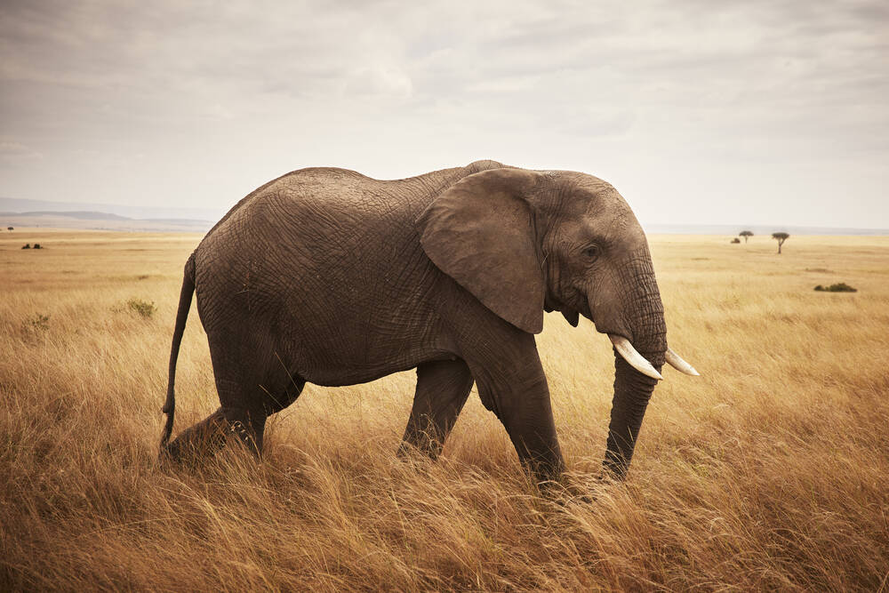
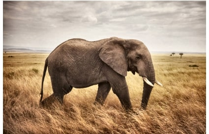
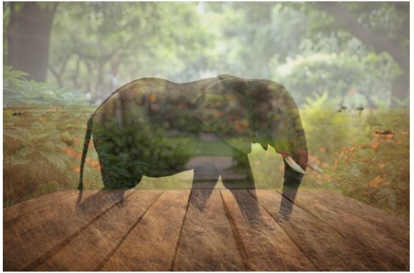

# Selective Color Pop & Edge Stylizer

## Problem Statement
This project creates an artistic stylization of an image using OpenCV. The main subject is highlighted, while the background is muted and blurred, with artistic edge outlines.

## Features
- Global contrast enhancement using CLAHE
- Automatic subject mask creation
- Edge-preserving smoothing on the subject
- Desaturation and slight blur on the background
- Overlay of artistic edges from Canny edge detection
- Blending of subject and background for a final stylized effect

## Folder Structure
- `notebooks/` : Jupyter notebook of the project
- `images/` : Input and output images
- `selective_stylizer.py` : Python script version (optional)

## Usage
1. Open `notebooks/selective_stylizer.ipynb` in Jupyter Notebook
2. Run all cells to generate outputs
3. Final output will be saved as `images/stylized_result.jpg`

## Example Output

### Original Image

### Subject Mask Preview

### Enhanced Image (CLAHE)

### Final Stylized Result

